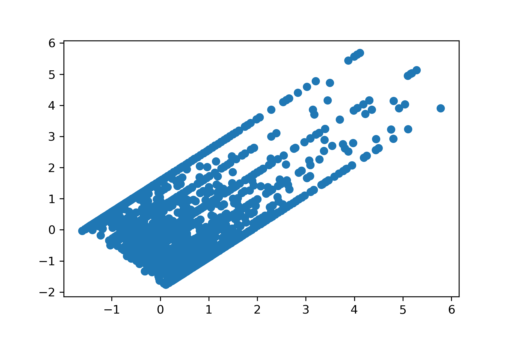
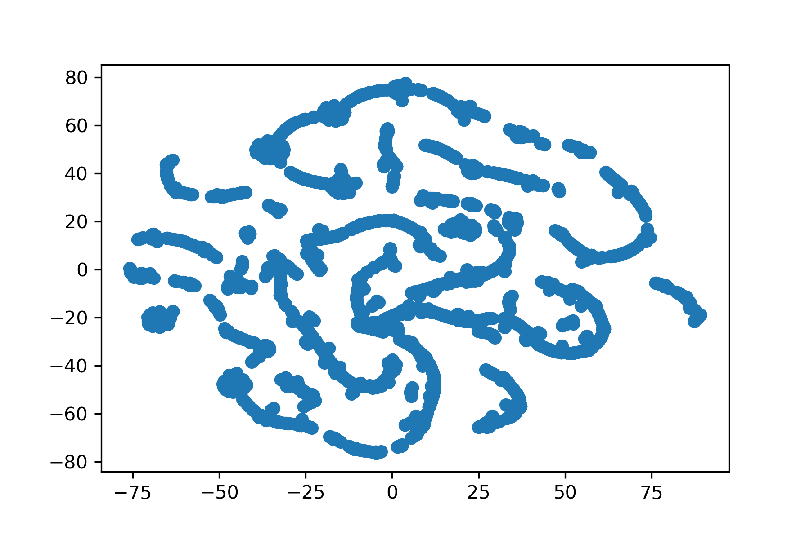
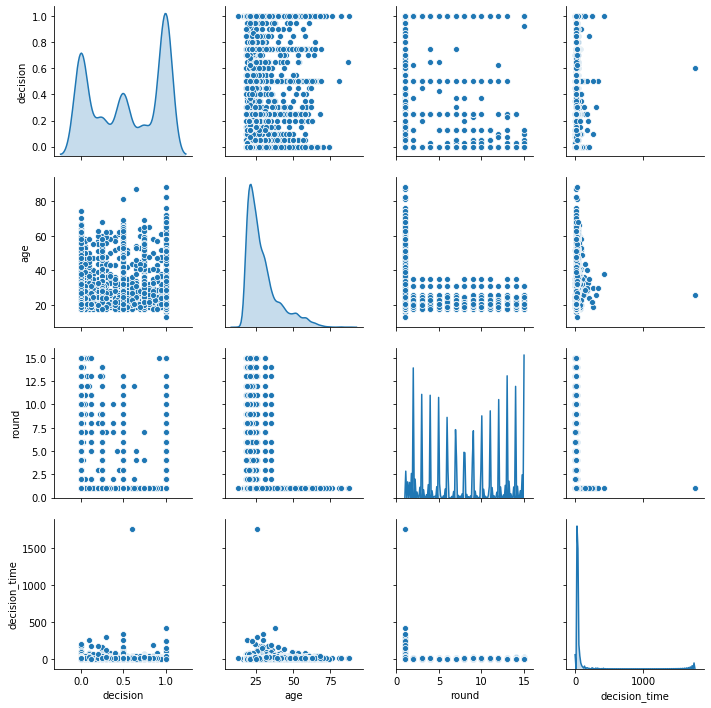
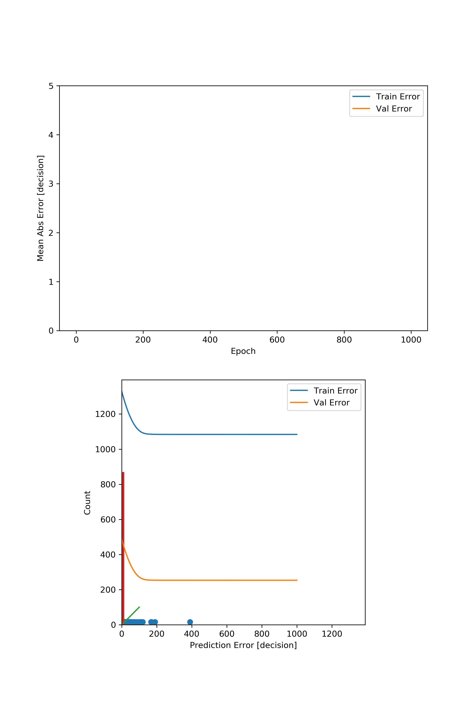

# PSY_analysis

## Model Analysis
### PCA

### TSNE

## Model Analysis
### Pairplot

### Prediction Error

## Result
For 100Epoch
O | SimpleModel | DeepNet | -
---- | ---- | ---- | ----
loss | 363.6520 | 589.2556 | -
mse | 363.6520 | 589.2556 | -
